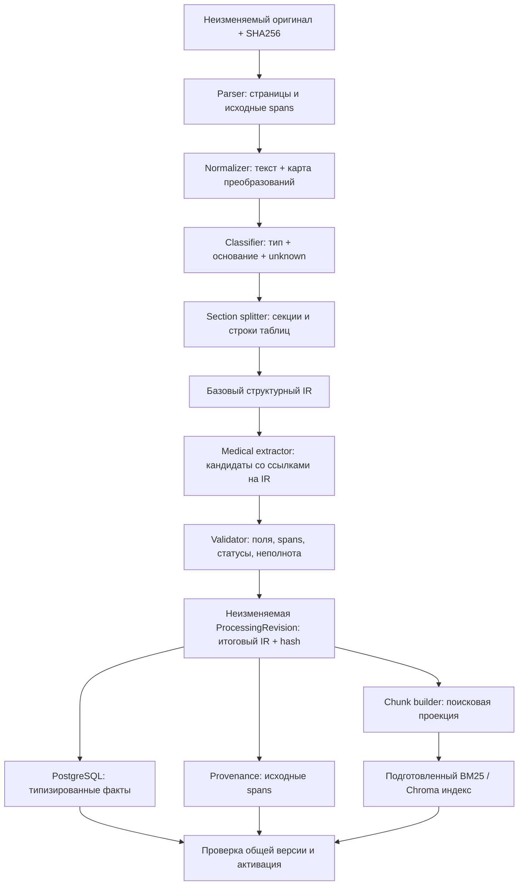

# Medical Document Processing Pipeline — план реализации

Дата: 2026-09-25. Статус: **план в реализации: готовы основа source IR, development baseline, opt-in лабораторные строки, стадия разбора до LLM и полный recipe; полный pipeline ещё не реализован**. Основание — запрос автора и три приложенных конспекта. Это развитие после учебного MVP v1.2, а не ретроактивное требование преподавателя. Нормативные дополнения перечислены в [корневой спецификации](../PROJECT_SPECIFICATION.md). Реальные результаты остаются в [VALIDATION](VALIDATION.md).

Продуктовая рамка уточнена автором: [самостоятельный real-world проект](PRODUCT_DIRECTION.md). LAB_REPORT/VISIT — первый вертикальный срез, а не окончательный предел поддерживаемых документов.

## 1. Решение и первый результат

Выделить обработку документов в отдельную логическую подсистему внутри существующих Python AI-service и NestJS worker. Новый микросервис и брокер для первого этапа не нужны. Начать с **LAB_REPORT и VISIT**: лабораторная строка с контекстом и связное утверждение врача. TXT/MD и PDF с текстовым слоем остаются обязательными; NOTE использует общий абзацный путь. Другие типы сохраняют текущий ограниченный путь с явным указанием версии и качества обработки.

Главный инвариант: **факты, provenance и поисковые чанки — проекции одной неизменяемой версии IR**, а не три независимых результата обработки сырого текста. IR (intermediate representation) — страницы, блоки, секции, строки таблиц и проверенные аннотации с привязкой к исходнику.

Первый вертикальный результат: загрузить новый синтетический лабораторный PDF через обычный API, получить проверяемые строки анализов, показать их источник и найти каждую через поиск. В этом сценарии нельзя использовать заранее подготовленные seed-факты.

Порядок дальнейшего развития: **ingestion → structured tools → маршрутизация → ограниченный агент → справочная библиотека и комбинированные ответы**. Контракты справочной библиотеки можно проектировать раньше, но она не блокирует ingestion. [План следующих слоёв](MEDICAL_KNOWLEDGE_PLAN.md).

## 2. Что уже есть и чего не хватает

Аудит выполнен по ветке `codex/clinical-archive`, базовый commit `744c57e`.

| Область | Реализовано | Пробел следующего этапа |
| --- | --- | --- |
| Parse | `parsing.py`: pypdf, страницы, TXT/MD, предупреждение о пустых страницах | Нет структурных блоков, координат и надёжного восстановления таблиц |
| Extract | `extraction.py`: JSON-схема, проверка цитаты/страницы, повтор | Классификация и факты генерируются вместе; длинные страницы режутся по символам; ограничение числа фактов может дать неполноту |
| Chunk | `chunking.py`: абзацы, предложения, строки и целые overlap-единицы | Один splitter для всех типов; нет общего IR с extractor; длинная единица имеет fallback-разрез |
| Facts | `MedicalFact`, review, оригинальное значение | Нет типизированной лабораторной строки с референсом, subject и истории состояний лекарства |
| Provenance | Версия текста, страница, точная цитата | Одна запись на факт; нет нескольких spans, привязок отдельных полей и карты нормализации |
| Reprocess | Устойчивая очередь, generation, версии, защита проверенных фактов | Нет общей processing revision для IR, фактов и индекса; нет подготовки новой версии до переключения |
| Оценка | Повторы QA, модели/поиск, synthetic seed | 108 seed-фактов предвычислены; QA 10/10 не доказывает точность ingestion новых документов |

## 3. Поток данных и владельцы



Связь с исходником создаётся **на Parse**, а не задним числом после LLM. Provenance stage проверяет/материализует существующие ссылки. Extractor возвращает кандидаты и IR-идентификаторы; окончательные offsets и цитаты вычисляет и проверяет код. Тип документа можно уточнить после segmentation, но неизвестный тип не угадывается ради применения шаблона.

- Python: parser adapters, нормализация, структурный IR, извлечение кандидатов, валидация, детерминированные проекции и индексирование.
- NestJS/PostgreSQL: источник истины для processing revisions и активной версии, очередь/повторы, фиксация фактов, пользовательский review, аудит, операции активации.
- React: статус стадий, качество/неполнота, исходная страница и цитата, сравнение версий, повторная обработка.
- Векторный индекс — восстанавливаемая проекция, не владелец медицинских фактов.

## 4. Контракт IR v1

Это проект контракта, не существующий API. Полную JSON Schema и синхронные Python/TypeScript validators выпускаем на этапе P1.

| Группа | Обязательная семантика |
| --- | --- |
| Identity | `documentId`, `sourceRevisionId`, `sourceSha256`, `processingRevisionId`, `irSchemaVersion`, `irHash` |
| Recipe | Версии parser/normalizer/classifier/segmenter/extraction prompt/fact schema/validator/chunker, digest модели и embedding, параметры, hash конфигурации/словаря |
| Pages | Порядок, `pageNumber` (null для текста), точный `rawText`, его hash; необязательные bbox и quality flags |
| Blocks | `blockId`, paragraph/heading/table/row/list/header/footer/unknown, текст, `sourceSpans[]`, `normalizedText`, transform map, section/parent/continuation |
| Sections | `sectionId`, тип секции, исходный заголовок, порядок и IDs блоков; классификация с методом и неопределённостью |
| Metadata | Тип документа, исходная/нормализованная дата, роль даты, её точность и spans; неизвестные поля null |
| Facts | Ссылки на блоки/строки, типизированный payload, per-field provenance, validation status, subject, assertion/medication state, временная привязка |
| Quality | Перечень машинных issue codes, покрытие страниц/блоков/строк, усечения и неподдержанные области; без ложного общего «всё извлечено» |

Пример одной лабораторной аннотации (ID здесь условные; это фрагмент IR, не полный валидный документ):

```json
{
  "blockId": "lab-row-7",
  "kind": "laboratory_result",
  "nameOriginal": "ЛПНП",
  "canonicalName": "LDL",
  "valueOriginal": "4,1",
  "valueDecimal": "4.1",
  "comparator": "EQ",
  "unitOriginal": "ммоль/л",
  "unitCanonical": "mmol/L",
  "referenceOriginal": "< 3,0",
  "reference": {"upper": "3.0", "upperInclusive": false},
  "abnormalReported": null,
  "abnormalDerived": "HIGH",
  "eventDate": {"value": "2026-05-14", "role": "specimen", "precision": "DAY"},
  "subject": "PATIENT",
  "sourceText": "ЛПНП 4,1 ммоль/л < 3,0",
  "sourceSpanIds": ["span-row-7"],
  "contextSpanIds": ["span-table-header", "span-specimen-date"],
  "validationStatus": "VALID"
}
```

Числа передаются десятичными строками и сохраняются в PostgreSQL NUMERIC, с исходной записью отдельно. Значения `<0,1`, `>100`, качественные результаты и интервалы не превращаются в обычное равенство float. Для существующего `double precision` нужна явная миграция: legacy float нельзя объявлять восстановленным точным оригинальным числом.

## 5. Нормализация и происхождение каждого значения

- Оригинальный файл и снимок распарсенных страниц неизменяемы. Нормализованный текст хранится рядом; исходник не переписывается.
- Span задаёт source revision, страницу и полуинтервал `[start,end)` **в UTF-8 байтах текста этой страницы**. Python и Node проверяют одинаковую последовательность байтов; JS UTF-16 индексы напрямую использовать нельзя. Для составной цитаты допустим список spans.
- Карта преобразований поддерживает один-к-нескольким/несколько-к-одному spans. Поля value/unit/range/date привязаны к своим spans и контексту строки. Отображаемая цитата восстанавливается из rawText, а не генерируется из нормализованного значения.
- Нормализация пробелов, NBSP, переносов и мягких дефисов разрешается только с картой происхождения. Разделитель десятичной дроби и единицы канонизируются в отдельных полях; минус, знак сравнения, дозировка, длительность, отрицание сохраняются.
- Повторяющиеся headers/footers помечаются как layout и исключаются только из поисковой проекции. Они не удаляются из raw/IR. Одного повторения текста недостаточно: повторяющаяся аллергия, диагноз, единица или дата могут быть значимы. При неуверенности блок остаётся.
- pypdf text-only не гарантирует распознавание колонок. Parser adapter с layout выбирается по отдельному сравнению качества/зависимостей; до этого неоднозначная таблица получает `TABLE_LAYOUT_AMBIGUOUS`, а не выдуманные связи колонок. Сканированный PDF по-прежнему требует OCR; OCR — отдельный будущий этап.
- Unknown и неполнота — результаты обработки, не исключения, которые можно замолчать. Отсутствие единицы/референса не восполняется модельной памятью.

## 6. Семантика медицинских фактов

**Лаборатория.** Единица результата: показатель + value/comparator + unit + исходный reference + flag + specimen/result date + контекст лаборатории/метода, если указан. Объединять строки на разных страницах можно только при подтверждённом продолжении и одинаковом контексте. Reference берётся из этого бланка; неоднозначные возрастные/половые диапазоны не выбираются по догадке. `abnormalReported` и детерминированное `abnormalDerived` разделены; при конфликте требуется review. Учебник не заменяет референс лаборатории. Пересчёт единиц по умолчанию выключен; будущий пересчёт хранит формулу, версию и исходное значение, а несовместимые измерения не соединяет в одну числовую серию.

**Диагнозы/симптомы.** Subject: PATIENT / FAMILY / OTHER / UNKNOWN. Отдельно assertion: CONFIRMED / SUSPECTED / NEGATED / NOT_CONFIRMED / RULED_OUT / UNKNOWN; temporality и clinical activity — отдельные поля. «Не подтверждён» не равно «исключён», «в анамнезе» не равно «активен». Это утверждения документа, не установленные системой диагнозы. Human reviewStatus не смешивается с assertion.

**Лекарства.** Хранить события CONSIDERED / RECOMMENDED / PRESCRIBED / STARTED / TAKING_REPORTED / NOT_STARTED / STOPPED / UNKNOWN, дозу, путь/режим, длительность, дату и её точность. Событие о приёме год назад не доказывает приём сегодня; tool отвечает «последнее документированное состояние на дату». Назначение не создаёт событие фактического старта.

**Даты.** Различать document / encounter / specimen / result / event / authored; хранить оригинальную строку и точность DAY/MONTH/YEAR/UNKNOWN. Не превращать загрузку в медицинскую дату и 2025 год в 1 января. Конфликтующие даты сохранять как кандидаты/issue, не выбирать последнюю автоматически.

**Согласование.** Удалять только технические дубли одной и той же исходной записи. Два визита с одинаковым показателем — два наблюдения. Противоречия между источниками показывать с датами/ссылками; не переписывать старую запись «новой истиной». Проверенное пользователем значение — отдельный overlay с историей; повторное извлечение не перезаписывает его. Если исходная привязка изменилась, overlay требует повторного сопоставления, а не приклеивается по одному имени показателя.

## 7. Chunk builder из того же IR

| Тип | Атомарная единица | Контекст чанка |
| --- | --- | --- |
| LAB_REPORT | Полная строка результата; связанные строки небольшой панели | Названия колонок, единицы/референсы, дата и источник контекста |
| VISIT / VISIT_TRANSCRIPT | Секция и законченные утверждения | Жалобы, анамнез, assessment, назначения разделены; семейный субъект и отрицания не отрываются |
| DISCHARGE_SUMMARY | Диагнозы, течение, лечение, рекомендации | Раздел и временная роль; специальный профиль после LAB/VISIT |
| NOTE / OTHER | Абзац/пункт; при превышении — связные предложения | Заголовок и привязка к версии; unknown явно допустим |

Лимит контекста остаётся: «семантический chunk» не означает неограниченный размер. Сначала делить на целые строки/утверждения; слишком длинную неделимую единицу направить в ограниченный source-read с continuation/предупреждением. Нельзя обрезать медицинскую строку и объявить полный охват. Дублируемые заголовки помечать как контекст с собственными span IDs, а не выдавать за непрерывную цитату.

Разделить `searchText` и `sourceSpans`: поисковый текст может содержать нормализованные термины/заголовки, а цитаты должны разрешаться в исходные spans. Нынешнюю проверку exact substring необходимо адаптировать к этому контракту: нормализованный поисковый текст сам по себе больше не доказательство. Обязательные metadata: processingRevisionId, irHash, section/block IDs, source spans, chunker version, correction marker. Эти внутренние поля не выходят в публичный MCP.

## 8. Хранение, API и безопасная смена версии

Предлагаемая явная миграция: `processing_revisions` (immutable IR JSONB, hash, recipe, source revision), `processing_artifacts` (стадия, manifest, безопасный статус), `Document.activeProcessingRevisionId`; ссылки processing revision на фактах/индексе и многозначный provenance. Типизированные payload labs/medications/conditions расширяют текущие факты; legacy-поля читаются до backfill. После фиксации IR его не изменяют: повтор/коррекция создают следующую revision.

Внутренние versioned контракты вводятся совместно в NestJS/Python: `process → IR+manifest`; `stage_index(IR, revision) → manifest`; ask/search получают разрешённые `(documentId, processingRevisionId)` из backend snapshot. Indexer проверяет hash/schema и строит проекцию из IR, не запускает повторный независимый extract. Старый `/internal/process`/`index` остаётся до завершения миграции; старые клиенты явно используют legacy-версию.

PostgreSQL и Chroma не имеют общей транзакции. Поэтому протокол такой:

1. Durable job привязан к source revision, document generation и recipe hash; подготовить новую processing revision без замены активной.
2. Сохранить кандидаты фактов/provenance и подготовить индекс с новой revision; read path пока использует только старую активную.
3. Сверить manifests: одна IR revision/hash, все обязательные стадии завершены, качество объявлено явно; подтвердить готовность индекса.
4. Короткой PostgreSQL-транзакцией проверить generation/deletedAt/source revision, переключить указатель активной версии и видимость её фактов. Чтение facts + retrieval всегда использует один зафиксированный snapshot `(processingRevisionId, reviewRevisionId)`. Пользовательский overlay имеет отдельную неизменяемую review revision; его проекция в факты/чанки переключается согласованно и не изменяет базовый IR. Проверить его актуальность перед выдачей.
5. Сбой до переключения сохраняет старый **полный** снимок при неизменном исходнике. Если документ удалён или исходный текст изменён, старый снимок исключён — устаревшее содержание не возвращается как текущее.
6. Сбой/рестарт после переключения восстанавливает индекс из сохранённого IR. При отсутствии нужной revision выдача блокируется или явно сообщает недоступность; запрещено подставлять другую revision.
7. Повтор с тем же idempotency key возвращает сохранённый артефакт, не дублирует факты. Явный исследовательский повтор имеет отдельный run ID. Старые артефакты удаляются только после периода удержания и проверки отсутствия читателей.

`Reprocess` получает понятный выбор: «текущий отредактированный текст» или «заново разобрать оригинал». Новый parser не должен незаметно затереть пользовательский текст. Для смены только chunker/embeddings переиспользуется IR, LLM-извлечение не требуется. Recipe hash включает фактические digests/настройки; одинаковый recipe не обещает побитовую детерминированность LLM.

UI показывает processing state отдельно от качества: READY не означает «все факты распознаны». Нужны coverage по страницам/строкам, unresolved issues, текущая/подготовленная версия и переход из значения к исходной странице. Логи — только IDs операций, этапы, счётчики, длительности, фиксированные error codes; содержательные IR и ответы в Git не попадают.

## 9. Проверка ingestion и критерии приёмки

Предлагаемые критерии ниже — **будущие gates, не полученные результаты**. Два набора: development fixtures и заранее замороженный отложенный набор. Минимум 24 синтетических оригинала: 12 лабораторных (не менее 120 размеченных строк) и 12 VISIT (не менее 80 утверждений), из них минимум 8 документов отложены от настройки. Варианты: переносы, шапки, несколько страниц/колонок, десятичная запятая, знаки `<`/`>`, разные единицы, пустой референс, две даты, семейный анамнез, отрицание, подозрение/неподтверждение, назначен/не начал/отменён. Gold создаётся отдельно от вывода тестируемой модели и проходит ручную проверку; он не доступен extraction/indexing.

| Gate | Проверка до включения нового pipeline по умолчанию |
| --- | --- |
| P0: baseline | Загрузить оригиналы обычным API на пустой БД; сохранить исходные провалы, precision/recall полей и время. Seed/precomputed facts запрещены |
| P1: source integrity | 100% принятых полей/цитат разрешаются в правильную версию и страницу; 0 потерь значимых чисел/единиц/отрицаний в тестах преобразований |
| P2: structured quality | На замороженном наборе в каждом из 3 прогонов: lab tuple precision ≥99%, recall ≥95%; VISIT subject/assertion/medication-state macro-F1 ≥0.95; отдельные counts FP/FN по каждому полю |
| P2: critical errors | 0 неверно принятых доз, единиц, знаков сравнения, subject и превращений suspected/negated/prescribed в confirmed/taking. Неуверенный факт — review/unknown, его пропуск учитывается в recall |
| P3: consistency | У активных facts, provenance и chunks один processing revision/hash; 0 дублей/смешения версий после crash injection, параллельных edit/delete/reprocess и рестартов |
| P4: end-to-end | После настоящей загрузки проходят прежние 10 QA-вопросов, включая все 19/22 лабораторных отклонения; результаты не берутся из seed DB |
| P4: deployment | Чистый Compose, миграции пустой и существующей БД, повторный запуск и восстановление; старые оригиналы/review не потеряны |

Метрики полного просмотра и extraction recall различаются. Exact tuple: test + comparator/value + unit + reference + date-role + subject + source; ошибки не скрываются усреднением по заполненным полям. Неподдержанные/пропущенные документы входят в знаменатель с отдельной причиной. Метрики по моделям 4B/9B/серверной Q8 27B, три полных прогона; фиксировать latency p50/p95, память, budget, digests, версии/recipe/gold, parser-only и end-to-end результаты отдельно. Если gate не пройден, профиль остаётся opt-in и частичным. Unit/contract tests проверяют механизмы, реальные LLM-серии — качество.

Дополнительные обязательные проверки: prompt injection в PDF/таблице остаётся данными; исходная цитата и статус не подменяются пользовательским overlay; публичный MCP сохраняет четыре tools и фиксированный синтетический корпус. Переиспользование parser/chunker для MCP не разрешает генерацию в index/status или доступ к личному IR.

## 10. Пакеты реализации и зависимости

| Этап | Изменения | Готовность |
| --- | --- | --- |
| P0 | Новые original-upload fixtures, отдельный gold/runner, baseline на текущем коде | Воспроизводимый исходный отчёт, никаких предвычисленных фактов |
| P1 | IR schema, span resolver, normalization map, processing revision, parser adapter; миграция | Contract/golden tests, чтение исходной цитаты, сохранность старых данных |
| P2a | LAB_REPORT: таблицы, типизированные значения/референсы/даты, валидатор | Gates лаборатории; неизвестные/неоднозначные строки видны |
| P2b | VISIT: секции, subject/assertion, medication events | Gates VISIT, отсутствие потери отрицаний и семейного контекста |
| P3 | Проекции из IR, staging индекса, activation snapshot, retry/reprocess и UI review | Crash/concurrency tests, единая revision, rollback без перезаписи оригинала |
| P4 | Полные серийные оценки и чистый Docker; ограниченный opt-in → default только после gates | Опубликованные агрегаты всех попыток и инструкция восстановления |
| P5 | Предметные structured tools и deterministic router | Числовые запросы без повторного LLM-извлечения; явное покрытие |
| P6 | Ограниченный агент, отдельный reference index и UI разделения источников | Сравнение с простым router, отсутствие смешения пациентских и справочных фактов |

P0 → P1 → P2a → P2b → P3 → P4; затем P5 → P6. Выписка/специализированный discharge chunker, OCR, полная терминологическая онтология, автоматическая диагностика, автообновление справочников и масштабный перенос личного архива в первый этап не входят. Длительности не фиксируются до baseline: сложность восстановления таблиц ещё не измерена.

## Первый рабочий срез

[Source IR и original-upload baseline](evaluation/INGESTION_BASELINE.md): реализована сохраняемая стадия SOURCE_ONLY с UTF-8 mappings, JSON Schema, приватным API и миграцией. Полный recipe и сохранение стадии разбора до LLM добавлены позже (см. ниже); P0 ещё требует независимого held-out corpus. Медицинские аннотации и facts/chunks из IR относятся к следующим шагам.

[Следующий срез LAB](evaluation/lab-rows-v1/README.md): source-backed annotation и fact projection, UI, 120/120 × 3 на замороженном наборе. Это только поддержанные лабораторные грамматики; VISIT, полный P0/P1 и единые чанки/activation остаются открытыми.


[Первый срез VISIT](evaluation/visit-assertions-v1/README.md): opt-in clinical-v1, модельная разметка субъектов/статусов/лекарственных событий/временных ролей, source/context spans и консервативная проекция в старые факты. Полная clinical activity, нормализация календарных ролей, единые chunks/processing revision/activation и gates остаются открытыми; достигнутые результаты отдельно от плана.

[Стадия разбора и полный recipe (P1)](../ARCHITECTURE.md#стадия-разбора-до-llm-и-полный-recipe-p1-25-сентября-2026): `/internal/parse` без модели, сохранение IR с parse recipe до извлечения, извлечение только из сохранённого IR, полный `processingRecipe` с кросс-языковым hash, повтор задачи без повторного разбора. Выбор «текущий текст или заново разобрать оригинал» и подтверждение настроек индекса индексатором сделаны в P3.

[Processing revision и активация (P3)](../ARCHITECTURE.md#processing-revision-и-активация-facts-и-chunks-p3-26-сентября-2026): факты и chunks новой обработки готовятся неактивными в одной ревизии, индекс ставится по ревизии, активация одной транзакцией, ответы читают только активную ревизию, повтор после сбоя индексации без повторного извлечения. [Продолжение](../ARCHITECTURE.md#режим-reprocess-подтверждённые-настройки-индекса-и-правка-текста-p3-26-сентября-2026): режим reprocess, настройки индекса подтверждает индексатор, факты прежнего текста видны с пометкой до обработки правки. Crash injection на уровне процесса и параллельный reprocess нескольких документов под нагрузкой ещё не проверялись.

## Проверка несколькими методами после LAB-пилота

[Согласование текстового слоя, OCR и визуальной модели](MULTIMODAL_INGESTION_PLAN.md) — следующий контракт качества для лабораторных документов. Реализован только read-only resolver расхождений; OCR-адаптер, сканированные и смешанные PDF в активном ingestion пока не поддерживаются. Даже согласие трёх методов не утверждает факт автоматически.
