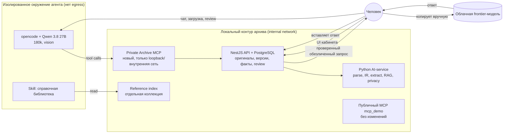

# Целевая архитектура: локальный агент Qwen, архив через MCP и ручной облачный цикл

Решение автора, 25 сентября 2026. Статус документа: **целевое состояние и план**, сверенный с кодом ветки `main` на коммите `285a62a`. Здесь явно разделено, что уже работает, что есть частично и чего нет. Документ не заявляет новых пройденных проверок; фактические результаты по-прежнему только в [VALIDATION](VALIDATION.md).

Место в иерархии документов: нормативные дополнения перечислены в [корневой спецификации](../PROJECT_SPECIFICATION.md). Этот документ задаёт конечную цель, в которую встраиваются [pipeline обработки документов](MEDICAL_DOCUMENT_PIPELINE_PLAN.md), [structured tools и справочная библиотека](MEDICAL_KNOWLEDGE_PLAN.md), [мультимодальная сверка](MULTIMODAL_INGESTION_PLAN.md) и [продуктовое направление](PRODUCT_DIRECTION.md). Спецификация v1.2 и её историческая приёмка не переписываются.

Правило ведения: любое изменение поведения или архитектуры обновляет этот документ (или соответствующий план) и таблицу статуса в §3 в том же PR.

## 1. Решение автора

Пересказ сообщения автора от 25 сентября 2026:

1. Основной интерфейс — **локальный чат-бот на базе opencode** с моделью **Qwen 3.8 27B** (контекст 180k) и визуальным энкодером. Агент ведёт архив через **MCP**.
2. На этапе загрузки материалы **максимально структурируются**, чтобы упростить обработку и поиск.
3. При добавлении материала Qwen **делает вывод и сопоставляет** его с уже имеющимися данными.
4. К Qwen подключаются **открытые учебники по медицине и лекарствам** как skill.
5. Главный сценарий: Qwen проводит исследование и готовит **деперсонализированный подробный запрос к облачной frontier-модели**. Человек вручную отправляет запрос, вставляет ответ обратно, Qwen сверяет его с архивом и делает выводы либо просит новый облачный запрос.
6. Qwen **заперт в ограниченном окружении** и не может автономно отправлять данные вовне.
7. Уточнение того же дня: Qwen подключается **через универсальный OpenAI-совместимый коннектор**. Runtime модели взаимозаменяем, если он отдаёт OpenAI-совместимый API.

## 2. Компоненты и границы доверия

**Подключение модели.** И opencode, и AI-service обращаются к модели по одному OpenAI-совместимому контракту (Chat Completions, при необходимости embeddings и изображения во входном сообщении). Адрес, имя модели и ключ задаются конфигурацией, код не привязан к конкретному runtime: подходят llama.cpp server, vLLM, Ollama в OpenAI-режиме и аналоги. Взаимозаменяемость не отменяет изоляцию: endpoint должен находиться внутри контура, а смена runtime или модели требует повторных реальных оценок, а не только проверки совместимости протокола.

Три жёсткие границы:

- **Агент не имеет исходящей сети.** Единственный путь данных наружу — человек, копирующий уже проверенный запрос с подтверждённым SHA256. Ни opencode, ни MCP, ни модель не получают HTTP-клиента во внешний мир, веб-поиска или облачного SDK.
- **Private Archive MCP — отдельный сервер**, не расширение публичного MCP. Публичный MCP (`index_folder`, `index_status`, `find_relevant_docs`, `ask_question`) сохраняет фиксированный синтетический корпус `mcp_demo`, sanitizer и запрет выбора корпуса. Личный архив через публичный MCP недоступен, как и сейчас.
- **Три пространства данных не смешиваются:** факты пациента, выводы агента и справочные материалы хранятся и цитируются раздельно. Ответ облачной модели — непроверенный внешний текст, не факт пациента.

## 3. Состояние: что есть, что частично, чего нет

Легенда: **есть** — реализовано и проверено в объёме, описанном в VALIDATION; **частично** — есть основа или opt-in эксперимент без прохождения gates; **нет** — не реализовано.

| Область целевой архитектуры | Статус | Что есть сейчас | Разрыв до цели |
| --- | --- | --- | --- |
| Хранение оригиналов, версии текста, факты, provenance, review, аудит | **есть** | NestJS + TypeORM + PostgreSQL, неизменяемые TextRevision, Provenance, FactRevision, AuditEvent ([ARCHITECTURE](../ARCHITECTURE.md)) | Находки ревью: правка значения может стать CONFIRMED, гонка правок и обработки ([ревью 25.09](#8-предусловия-безопасности)) |
| Локальная LLM | **частично** | Ollama, дефолт `qwen3.5:2b`; 9B в клинических сериях; `qwen3.8-27b-q8-100k-cuda` проверялась только на сервере mpc1 через опциональный `compose.llama-cpp.yaml` и контексте 100k | AI-service говорит с моделью по протоколу Ollama; OpenAI-совместимый путь есть только как shim в опциональном `compose.llama-cpp.yaml`, embeddings идут через Ollama. Нужен штатный OpenAI-совместимый коннектор для генерации (и embeddings, если endpoint их отдаёт). 27B с контекстом 180k не измерена; CPU-offload 27B остановлен из-за задержек до 425 с |
| Визуальный энкодер | **частично** | Read-only `vision_audit` сверяет таблицы лабораторных PDF с парсером, ничего не записывает ([пилот](evaluation/lab-vision-audit-v1/README.md)) | Загрузка изображений/сканов не поддерживается (`UNSUPPORTED_OCR_REQUIRED`); OCR нет; vision не участвует в ingestion. Не подтверждено, что выбранная сборка Qwen 3.8 27B мультимодальна: возможно, нужна отдельная vision-модель |
| opencode как интерфейс | **нет** | Интерфейс — веб-кабинет React и Ask Archive (LangGraph ArchiveRAG) | Конфигурация opencode, подключение локальной модели, отключение shell/file/web инструментов, изолированный контейнер |
| MCP к личному архиву | **нет** | Есть только публичный MCP на синтетическом корпусе | Новый Private Archive MCP (§4), его транспорт, авторизация и тесты границы |
| Структурирование при загрузке | **частично** | Source IR `SOURCE_ONLY` (страницы, spans, карта нормализации); opt-in `lab-rows-v1` (development 80/80, held-out 40/40 × 3); opt-in `clinical-v1` и `clinical-reviewed-v1` для VISIT (gates не пройдены); таблицы PDF с текстовым слоем | Полный pipeline P1–P4: processing revision, единая проекция facts/chunks, активация версий, другие типы документов ([план](MEDICAL_DOCUMENT_PIPELINE_PLAN.md)) |
| Вывод и сопоставление при добавлении материала | **нет** | Extraction создаёт факты из одного документа; ArchiveRAG отвечает на вопрос по нескольким | Слой «выводов агента» (§5): сравнение с существующими фактами, конфликты, динамика, связь с источниками, review |
| Справочная библиотека как skill | **нет** | Реестр кандидатов и требования к manifest/лицензиям ([план P6](MEDICAL_KNOWLEDGE_PLAN.md#4-минимальная-справочная-библиотека)); импорт не выполнялся | Импорт 2–5 разделов, отдельный индекс, инструменты `search_medical_reference`/`get_reference_section`, skill для opencode |
| Подготовка обезличенного облачного запроса | **есть (ручной путь)** | Консультация: rules + local LLM privacy, точный preview, подтверждение SHA256, экспорт Markdown, неизменяемые версии запроса | Запрос готовит пользователь из UI, а не агент по итогам исследования; нет проверки полноты «исследования» и шаблона frontier-запроса |
| Возврат ответа и сверка с архивом | **частично** | Ответы вставляются вручную, хранятся неизменяемо и привязаны к точной версии запроса; не становятся фактами | Агент не читает ответы; нет сверки утверждений ответа с архивом, цепочки «ответ → следующий запрос» и итогового вывода (§6) |
| Изоляция окружения | **частично** | Сеть `internal` для данных/AI/БД, loopback ingress с firewall, host-Ollama proxy на фиксированный endpoint | Отдельная сеть для агента без egress; opencode и его провайдер модели внутри контура; тест отсутствия исходящих соединений |
| Резервная копия и восстановление | **частично** | `scripts/archive_backup.py backup\|verify\|restore`: PostgreSQL, оригиналы и `ai_archive` с манифестом SHA-256, опциональное шифрование GnuPG, восстановление только в пустой проект со сверкой манифеста; в CI проверено на synthetic seed ([VALIDATION](VALIDATION.md)) | Снимок без остановки `gateway`/`backend`/`ai`; восстановление полного стека с AI/Ollama и личного архива владельцем не проверены; с агентом добавляются выводы и история исследований |

## 4. Private Archive MCP

Отдельный MCP-сервер для локального агента. Слушает только внутреннюю сеть контура (или loopback), требует секрет, отличный от демо-значений, и не публикуется через ingress для браузера. Обращается к данным через API backend, а не напрямую к PostgreSQL или файлам: backend остаётся владельцем данных, версий и аудита.

Инструменты чтения берутся из [плана P5](MEDICAL_KNOWLEDGE_PLAN.md#2-предметные-инструменты-внутри-приложения): `get_lab_history`, `get_medication_history`, `get_conditions`, `get_timeline`, `search_patient_documents`, `get_source_excerpt`, `search_medical_reference`, `get_reference_section`. Каждый возвращает `snapshot`, `items`, `sources`, `coverage`, `warnings`, `nextCursor`.

Инструменты записи — только предложения, которые меняют архив через обычные проверки backend:

| Инструмент | Что делает | Ограничение |
| --- | --- | --- |
| `add_material(inboxRef, note?)` | Ставит в очередь файл из выделенной папки входящих, куда человек положил материал | Никаких произвольных путей; оригинал неизменяем; дубликаты по SHA256 не создаются |
| `record_finding(...)` | Сохраняет вывод агента (§5) со ссылками на источники | Не создаёт и не меняет факт пациента; статус `PROPOSED` |
| `propose_fact_review(factId, ...)` | Предлагает исправление или подтверждение факта | Применяет только человек в UI; правка значения всегда даёт CORRECTED, не CONFIRMED |
| `prepare_cloud_query(researchId, draft)` | Создаёт черновик облачного запроса (§6) | Проходит общий privacy-слой; экспорт только после ручного подтверждения SHA256 в UI |
| `get_cloud_responses(researchId)` | Читает ответы, которые вставил человек | Возвращаются как внешний непроверенный текст с пометкой источника |

Удаления, изменения оригиналов, произвольный SQL, shell и доступ к файловой системе агенту не выдаются. Подтверждение review и экспорт наружу выполняет человек, а не агент: иначе ограничение «только вручную» станет формальным.

Текст документов, справочника и облачных ответов — данные, не инструкции. Сервер ограничивает размер выдачи, бюджет вызовов и таймауты; содержимое не пишется в серверные логи.

## 5. Структурирование при загрузке и выводы агента

Загрузка идёт через существующий pipeline, агент не заменяет его: parse → source IR → классификация → типизированные строки/утверждения → проекции фактов и чанков. Модель помогает там, где pipeline использует LLM, но результат проходит те же проверки spans, единиц, отрицаний и дат. Визуальный канал подключается только по [политике согласования](MULTIMODAL_INGESTION_PLAN.md): совпадение двух моделей не подтверждает значение, большинство не выбирается автоматически.

После того как документ стал READY, агент выполняет **сопоставление**: новые значения против истории показателя, новые утверждения против известных состояний, назначения против прежней лекарственной истории. Результат сохраняется как **вывод (finding)**, отдельная сущность со своими полями:

- тип: динамика, конфликт с прежними данными, новое подозрение в документе, пробел (чего не хватает), вопрос для исследования;
- текст вывода и ссылки на конкретные факты/spans, на которые он опирается;
- модель, версия промпта, snapshot архива, время;
- статус `PROPOSED` / `ACCEPTED` / `REJECTED` / `SUPERSEDED`, решение принимает человек.

Вывод агента никогда не становится фактом пациента, диагнозом или подтверждённым приёмом лекарства. Сохраняются действующие правила: подозрение не превращается в диагноз, назначение — в доказательство приёма, отсутствие записи — в отсутствие заболевания, временная последовательность — в причинность. При переобработке документа выводы, опиравшиеся на старую версию, помечаются устаревшими, а не переписываются.

## 6. Исследовательский цикл с облачной моделью

Объект **исследование (research)** связывает вопрос, выводы и последовательность облачных запросов. Цикл:

1. **Исследование.** Агент собирает доказательства из архива (structured tools, RAG) и справочника, записывает промежуточные выводы и явно отмечает охват и пробелы.
2. **Черновик запроса.** Агент формирует подробный обезличенный запрос: клинический контекст, относительные сроки вместо дат, где это достаточно, значения с единицами и референсами, конкретные вопросы к модели. Идентификаторы исключаются по общему правилу консультаций.
3. **Проверка.** Общий privacy-слой (rules + local LLM) проверяет весь текст; неоднозначность требует ручного решения. Человек читает точный preview и подтверждает SHA256. Любая правка сбрасывает подтверждение.
4. **Отправка вручную.** Человек копирует или скачивает Markdown и сам отправляет его в облачный сервис. Система ничего не отправляет.
5. **Ответ.** Человек вставляет ответ в UI или в чат opencode; ответ сохраняется неизменяемым и привязан к точной версии запроса, как сейчас.
6. **Сверка.** Агент разбирает утверждения ответа: что подтверждается архивом (с цитатами), что противоречит, что относится к общему знанию (сверяется со справочником), что нельзя проверить. Итог — новые выводы со статусом `PROPOSED`.
7. **Решение.** Агент либо формирует итоговое заключение исследования, либо предлагает следующий запрос с объяснением, чего не хватило. Следующая итерация снова проходит шаги 2–5.

Ответ облачной модели может содержать инструкции, ссылки или ошибки. Он не индексируется как документ пациента, не выполняется как инструкция и не попадает в публичный MCP. Цепочка запросов и ответов хранится, чтобы каждый вывод можно было проследить до конкретного запроса и ответа.

## 7. Справочная библиотека как skill

Skill для opencode — описание, когда и как пользоваться справочником, и доступ к двум инструментам поиска по отдельной локальной коллекции. Правила из [плана P6](MEDICAL_KNOWLEDGE_PLAN.md#4-минимальная-справочная-библиотека) сохраняются: manifest с лицензией, версией и атрибуцией на каждый источник, отдельные ссылки `medicalReference` в ответе, запрет превращать справочное утверждение в факт пациента, отдельная проверка RU→EN поиска. Начинать с 2–5 разделов из 2–3 источников с проверенной лицензией; OpenStax не включается без разрешения на AI ingestion. Весь справочник локальный: skill не ходит в интернет во время ответа.

Контекст 180k не заменяет поиск: справочник и архив подаются в модель через инструменты с цитатами и охватом, а не целиком.

## 8. Предусловия безопасности

Агент с записью в архив увеличивает поверхность атаки, поэтому до подключения Private Archive MCP закрываются находки ревью репозитория от 25 сентября (хранится вне Git, в файлах проекта), часть из них уже в работе отдельно:

- DNS-rebinding и CSRF на loopback-портах: allowlist Host и проверка Origin (сделано);
- запрет демо-паролей и демо-токенов в личном режиме (сделано);
- проверка многострочных цитат, чтобы нельзя было склеить несмежные фрагменты;
- правка значения факта всегда даёт CORRECTED;
- резервная копия и проверенное восстановление (сделано без снимка при работающих сервисах, см. таблицу выше).

Изоляция агента проверяется тестом: из контейнера opencode и модели не проходят соединения никуда, кроме Private Archive MCP и локального провайдера модели.

## 9. Противоречия с действующими документами и как они разрешаются

| Действующее правило | Противоречие | Решение в целевой архитектуре |
| --- | --- | --- |
| AGENTS.md и v1.2: MCP выдаёт только синтетический корпус; нельзя добавлять выбор личного корпуса в публичные инструменты | Агент должен вести личный архив через MCP | Отдельный Private Archive MCP, недоступный извне контура. Публичный MCP не меняется. Формулировку AGENTS.md стоит уточнить после подтверждения автором |
| Опциональный `compose.llama-cpp.yaml` передаёт исходный контекст на внешний endpoint | Цель — агент, запертый без выхода наружу | В целевом режиме провайдер модели находится внутри контура. Удалённый endpoint допустим, только если это собственная машина автора в той же изолированной сети; иначе это прежний явный режим под ответственность оператора |
| MEDICAL_KNOWLEDGE_PLAN: агент без SQL, файловой системы и сети | opencode по умолчанию — агент для кода с shell, правкой файлов и web fetch | В конфигурации opencode эти инструменты отключаются; доступны только инструменты Private Archive MCP и skill справочника |
| PRODUCT_DIRECTION / pipeline: сначала P0–P4 ingestion, потом tools и агент | Автор ставит агента в центр | Порядок сохраняется: агент без качественного структурированного ingestion будет отвечать по тексту, а не по данным. Первые этапы агента — только чтение |
| Нет OCR и изображений | Визуальный энкодер для загрузки материалов | Vision входит в ingestion только через политику согласования и held-out проверки; до этого сканы и фото явно помечены как неподдержанные |

## 10. Этапы

Нумерация продолжает [план pipeline](MEDICAL_DOCUMENT_PIPELINE_PLAN.md) (P0–P6); этапы агента обозначены A.

| Этап | Содержание | Критерий готовности |
| --- | --- | --- |
| A0 | Предусловия §8; P0–P2 pipeline для LAB/VISIT | Закрытые находки ревью с тестами; gates P2 по плану pipeline |
| A1 | Штатный OpenAI-совместимый коннектор в AI-service и opencode; выбор машины для Qwen 3.8 27B с контекстом 180k; vision-модель | Измерены latency p50/p95, пиковая память и стабильность на выбранной машине; записано в VALIDATION |
| A2 | Изолированный контейнер opencode, Private Archive MCP только на чтение (инструменты P5) | Тест отсутствия egress; тесты границы (нет личных данных в публичном MCP, нет произвольных путей); реальные вопросы к архиву через агента сравнены с Ask Archive |
| A3 | Инструменты записи: `add_material`, `record_finding`, `propose_fact_review`; слой выводов в БД и UI | Миграции, неизменяемость, review человеком; вывод не становится фактом; тесты при переобработке |
| A4 | Справочная библиотека и skill | Manifest лицензий, отдельный индекс, тесты разделения patient/reference, RU→EN gold |
| A5 | Исследовательский цикл: `prepare_cloud_query`, `get_cloud_responses`, сверка ответа, цепочка итераций | Запрос не уходит без подтверждения SHA256; privacy-набор на запросах агента; сверка ответа на синтетических ответах с намеренными ошибками и инструкциями |
| A6 | Vision/OCR в ingestion для сканов и фото | Политика согласования, held-out сканы, три полных прогона, false agreement |

## 11. Открытые вопросы к автору

- ~~Какой runtime для Qwen 3.8 27B?~~ Решено 25.09: универсальный OpenAI-совместимый коннектор, runtime взаимозаменяем. Остаётся открытым, на какой машине endpoint работает постоянно.
- Сама сборка Qwen 3.8 27B с визуальным энкодером или отдельная vision-модель рядом?
- Остаётся ли веб-кабинет основным местом review и подтверждения, а opencode — местом исследования? В этом документе принято «да».
- Может ли агент сам ставить материал в очередь из папки входящих, или загрузку всегда начинает человек? В документе принят вариант с папкой входящих.
